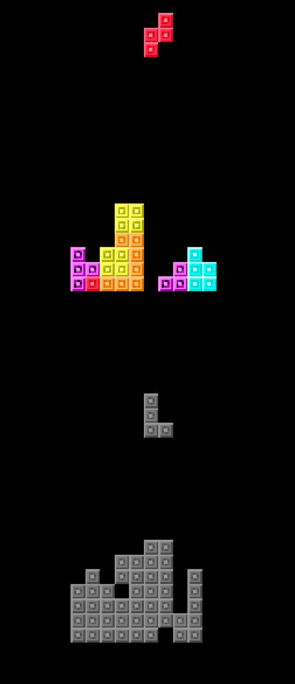

# turbitris

**turbitris** is a block stacking game with a twist:

- you control two boards simultaneously, being able to switch between them when needed.

- every once in a while, one of the boards will enter 'TURBO' mode, and the piece will fall one block every frame.

# CONTROLS

---------------

### NINTENDO DS:

A : Rotate counterclockwise or select option.

B : Rotate clockwise.

L : Switch between boards.

START: Pause/Unpause.

### BROWSER:

X : Rotate counterclockwise or select option.

Z: Rotate clockwise.

Q: Switch between boards.

ENTER: Pause/Unpause.

------------------

because of time limit (I started with less than 24 hours left to submit the game), things like holding a piece, showing the ghost piece, sound, among others, were skipped. ALSO expect bugs, mostly related to the piece rotation since I didn't have time to polish it. :/

yeah the name is awful, but it's because the game has a turbo state, and two boards at the same time, hence "turbo" + "bi". couldn't come up with something better, sorry.

and in case you didn't notice yet, the code is absolute spaguetti because I really had no time to do things right

anyways, hope you enjoy this little thing I made out of boredom :D.

[itch.io page](https://pansythoughts.itch.io/turbitris).
